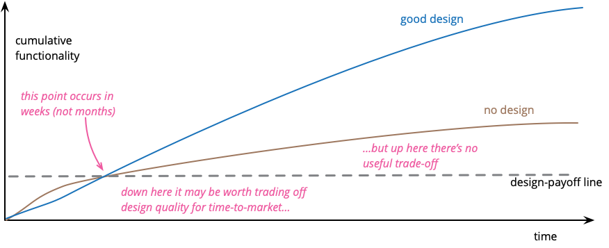

# We don't need OOP!
## IDC 2025
---

# Task

Produce multiple versions of the children's song using different casts of animals
---
---
# Legacy code
---

```python
song = """There was an old lady who swallowed a fly.
I don't know why she swallowed a fly - perhaps she'll die!

There was an old lady who swallowed a spider;
That wriggled and wiggled and tickled inside her.
She swallowed the spider to catch the fly;
I don't know why she swallowed a fly - perhaps she'll die!

There was an old lady who swallowed a bird;
How absurd to swallow a bird.
She swallowed the bird to catch the spider,
She swallowed the spider to catch the fly;
I don't know why she swallowed a fly - perhaps she'll die!

There was an old lady who swallowed a cat;
Fancy that to swallow a cat!
She swallowed the cat to catch the bird,
She swallowed the bird to catch the spider,
She swallowed the spider to catch the fly;
I don't know why she swallowed a fly - perhaps she'll die!

There was an old lady who swallowed a dog;
What a hog, to swallow a dog!
She swallowed the dog to catch the cat,
She swallowed the cat to catch the bird,
She swallowed the bird to catch the spider,
She swallowed the spider to catch the fly;
I don't know why she swallowed a fly - perhaps she'll die!

There was an old lady who swallowed a cow;
I don't know how she swallowed a cow!
She swallowed the cow to catch the dog,
She swallowed the dog to catch the cat,
She swallowed the cat to catch the bird,
She swallowed the bird to catch the spider,
She swallowed the spider to catch the fly;
I don't know why she swallowed a fly - perhaps she'll die!

There was an old lady who swallowed a horse...
...She's dead, of course!"""

print(song)  
```
---
# Shameless green
---
# TDD Development Loop
## Write a test.
Because the code does not yet exist, this test fails. Test runners usually display failing tests in **red**.

## Make it run.
Write the code to make the test pass. Test runners commonly display passing tests in **green**.

## Make it right.
Each time you return to green, you can refactor any code into a better shape, confident that it remains correct if the tests continue to pass.

---
# Is it time to refactor?
---
Design payoff 

---
---
How to refactor?
---
---
> Make the Change Easy, Then Make the Easy Change
― Kent Beck

- Change the design to support new functionality (no new features yet)
- Add new functionality
---
# First attempt at refactoring
---
# Bird-eye view
```python
def generate_song(old_subject, final_outcome, animals):
    """Generate the song based on the provided animals and settings."""
    song = ""
    animal_names = list(animals.keys())

    for i, animal in enumerate(animal_names):
        song += f"There was an old {old_subject} who swallowed a {animal}.\n"
        
        if animals[animal]:  # If there's a consequence
            song += f"{animals[animal]}\n"
        
        if animal!= animal_names[-1]:  # Not the last animal
            song += f"She swallowed the {animal} to catch the {animal_names[i-1] if i > 0 else 'fly'},\n"
        
        if i == 0:  # First animal
            song += f"I don't know why she swallowed a fly - perhaps she'll die!\n\n"
        elif i < len(animal_names) - 1:  # Middle animals
            for prev_animal in reversed(animal_names[:i+1]):
                song += f"She swallowed the {prev_animal} to catch the {animal_names[animal_names.\
                index(prev_animal)-1] if animal_names.index(prev_animal) > 0 else 'fly'},\n"
            song += f"I don't know why she swallowed a fly - perhaps she'll die!\n\n"
        else:  # Last animal
            song += final_outcome + "\n"
    
    return song
```
---
# Toulouse solution
- Aka "saw-tooth", "squint-test", and "tachicardia"
- "Anything can be solved with two nested loops"
---
# Zooming in
```pyton
 if animals[animal]:  # If there's a consequence
            ...
        
        if animal!= animal_names[-1]:  # Not the last animal
            ...
        
        if i == 0:  # First animal
            ...
        elif i < len(animal_names) - 1:  # Middle animals
            ...
        else:  # Last animal
            ...
```
---
# Comment is a smell
---
> “The proper use of comments is to compensate for our failure to express ourself in code. Note that I used the word failure. I meant it. Comments are always failures.”
― Robert C. Martin, Clean Code: A Handbook of Agile Software Craftsmanship

---
# What hides beneath?
- Primitive Obsession ― the link between the value and the meaning is only in your head
- An object trying to get out?
---
# Looking for negative space
```python
def generate_song(old_subject, final_outcome, animals):
    """Generate the song based on the provided animals and settings."""
    song = ""
    animal_names = list(animals.keys())
    # BLANK LINE
    for i, animal in enumerate(animal_names):
        song += f"There was an old {old_subject} who swallowed a {animal}.\n"
        # BLANK LINE
        if animals[animal]:  # If there's a consequence
            song += f"{animals[animal]}\n"
        # BLANK LINE
        if animal!= animal_names[-1]:  # Not the last animal
            song += f"She swallowed the {animal} to catch the {animal_names[i-1] if ...
        # BLANK LINE
        if i == 0:  # First animal
            song += f"I don't know why she swallowed a fly - perhaps she'll die!\n\n"
        elif i < len(animal_names) - 1:  # Middle animals
            for prev_animal in reversed(animal_names[:i+1]):
                song += f"She swallowed the {prev_animal} to catch the {animal_names[...
            song += f"I don't know why she swallowed a fly - perhaps she'll die!\n\n"
        else:  # Last animal
            song += final_outcome + "\n"
    # BLANK LINE
    return song
```
---
# Blank line is a smell
---
# Taking a step back
> "Smells don't always indicate a problem. You have to look deeper to see if there is an underlying problem there ― smells aren't inherently bad on their own ― they are often an indicator of a problem rather than the problem themselves."
― Martin Fowler (https://martinfowler.com/bliki/CodeSmell.html)
---
# Blank line means "AND"
---
- Blank line indicates that a function or a method are not single-reponsibility.
- Perhaps an object trying to get out:
  - first animal
  - last animal
  - not the last animal
  - middle animals
  - maybe consequence?
---
# Time to make it OOP
---
```python
class Song:

    def __init__(self, animals: dict, subject: str, outcome: str):
        self.animals = animals
        self.subject = subject
        self.outcome = outcome

    def generate_song(self):
    """Generate the song based on the provided animals and settings."""
    song = ""
    animal_names = list(self.animals.keys())

    for i, animal in enumerate(animal_names):
        song += f"There was an old {self.subject} who swallowed a {animal}.\n"
        
        if animals[animal]:  # If there's a consequence
            song += f"{animals[animal]}\n"
        
        if animal!= animal_names[-1]:  # Not the last animal
            song += f"She swallowed the {animal} to catch the {animal_names[i-1] if i > 0 else 'fly'},\n"
        
        if i == 0:  # First animal
            song += f"I don't know why she swallowed a fly - perhaps she'll die!\n\n"
        elif i < len(animal_names) - 1:  # Middle animals
            for prev_animal in reversed(animal_names[:i+1]):
                song += f"She swallowed the {prev_animal} to catch the {animal_names[animal_names...
            song += f"I don't know why she swallowed a fly - perhaps she'll die!\n\n"
        else:  # Last animal
            song += self.outcome + "\n"
    
    return song
```
---
# FOOP
- **F**aux **O**bject-**O**riented **P**rogramming
- Alternatively also **P**retend **OOP**
---

---
# Finding the right abstraction
---
# Noun and verb
There was an **old lady** who *swallowed* a **fly**.
I don't know why she *swallowed* a **fly** - perhaps she'll *die*!

There was an **old lady** who *swallowed* a **spider**;
That *wriggled and wiggled and tickled* inside her.
She *swallowed* the **spider** to catch the **fly**;
I don't know why she *swallowed* a **fly** - perhaps she'll *die*!

---
```python
class Animal:
    def __init__(self, name, action):
        self.name = name
        self.action = action  # maybe consequence?!
        self.stomach = list()  # ?!

    def swallow(animal: "Animal"):
        self.stomach.append(animal)

    @property
    def first(self) -> bool:
        ...

    @property
    def last(self) -> bool:
        ...

    @property
    def not_last(self) -> bool:
        ...

    @property
    def middle(self) -> bool:
        ...
```
---
```python
class OldLady:
    def __init__(self):
        self.stomach = list()  # ?!

    def swallow(animal: Animal):
        self.stomach.append(animal)
```
Maybe we need a base class?!
```python
class Swallower:
    def __init__(self):
        self.stomach = list()

    def swallow(animal: Animal):
        self.stomach.append(animal)
```


